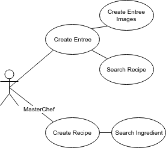
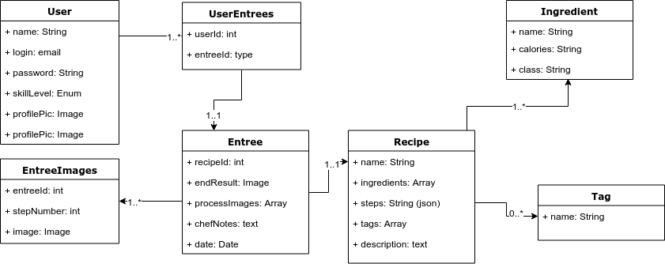

This is the backend for 'imadethis' which is a recipe logging application. 
The frontend is a vue.js application. See: https://github.com/Hersh3yy/imadethis-vue

App users can log their entrees. An entree is their attempt at making a recipe. They can add their own personal note and an image of the result.

Chefs (preferibly with a higher role) can make a new recipe when making an entree or can choose from a list of existing entrees.

To run locally:

node app.js

## Intended use cases

### Eventual ERD

